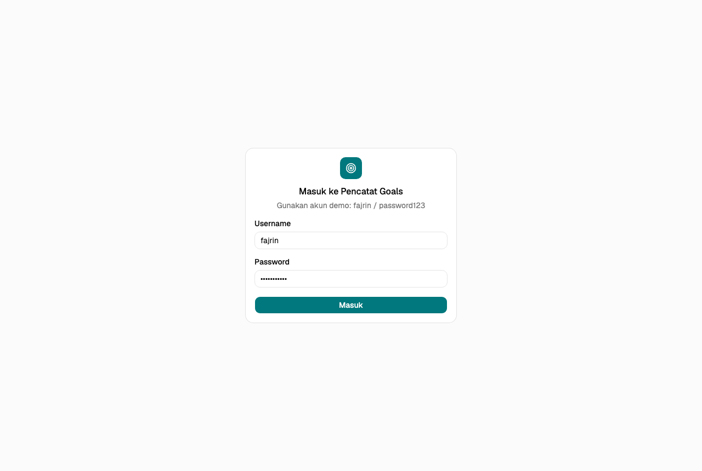
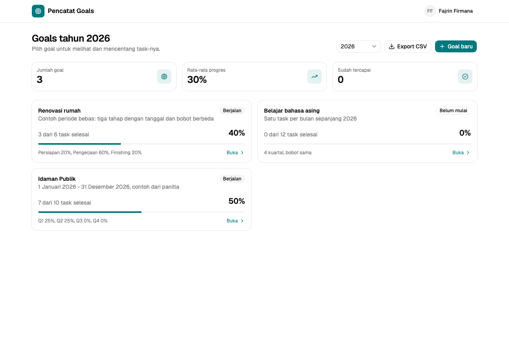
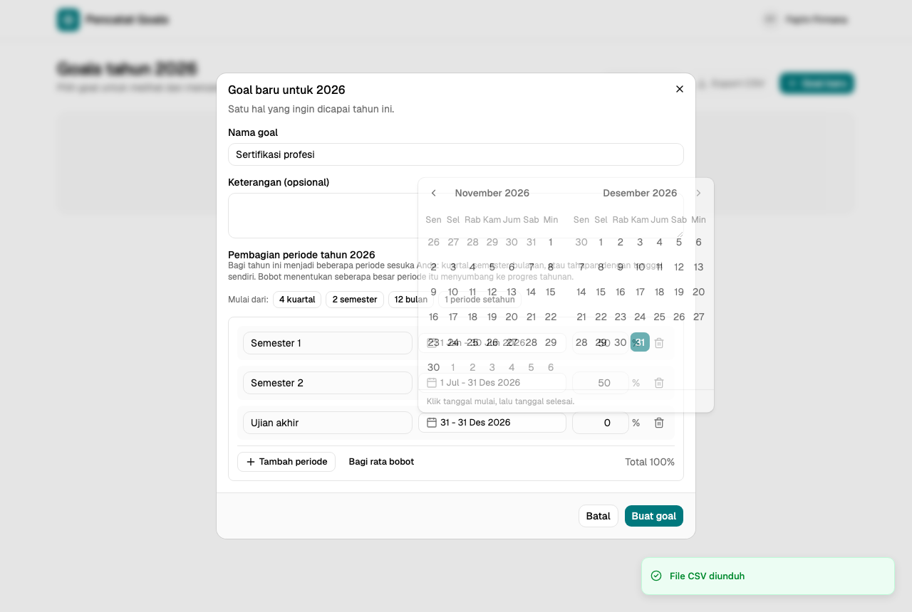
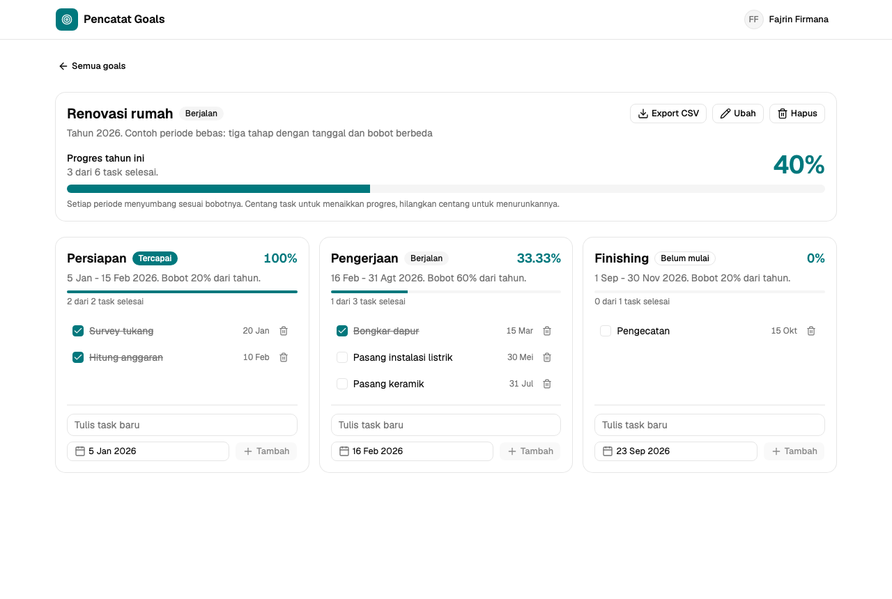
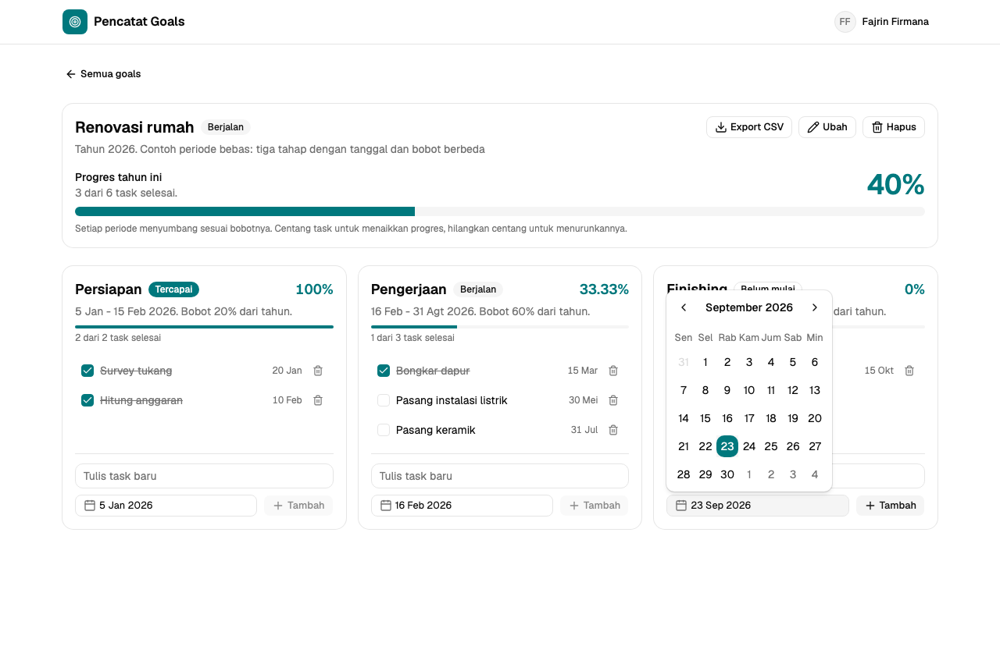
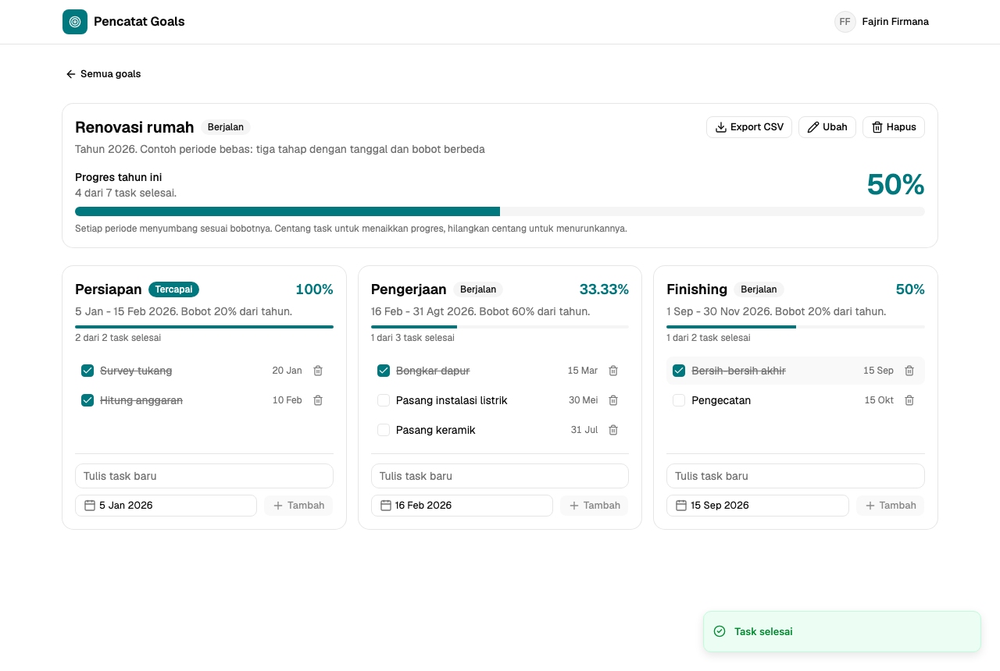
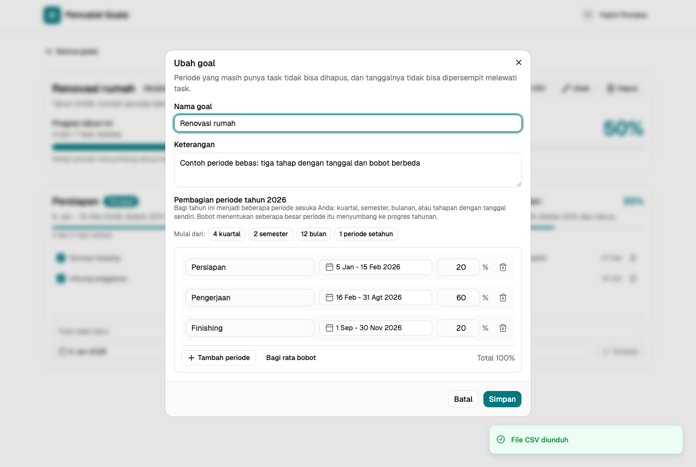

# Dokumentasi Aplikasi Pencatat Goals

Aplikasi web untuk mencatat goal tahunan, memecahnya menjadi periode dan task,
lalu memantau persentase progres yang dihitung otomatis.

Dibuat oleh: Fajrin Firmana
Database: `fajrin_firmana` di server MySQL panitia
Repositori: https://github.com/fxjrin/diskominfo-note-goals

## 1. Gambaran umum

Struktur datanya sederhana:

| Istilah  | Arti                                                                 |
| -------- | -------------------------------------------------------------------- |
| Goal     | Satu hal yang ingin dicapai dalam satu tahun, mis. "Renovasi rumah". |
| Periode  | Pembagian tahun untuk goal itu: bisa 4 kuartal, 2 semester, 12 bulan, atau tahapan bebas dengan tanggal sendiri. Setiap periode punya bobot (%) terhadap progres tahunan. |
| Task     | Langkah kecil di dalam periode, punya tanggal dan status selesai/belum. |
| Progres  | Persentase 0-100 yang dihitung ulang otomatis setiap kali task berubah. |

Cara kerja progres:

- Progres periode = task selesai / total task di periode itu x 100.
- Progres goal = jumlah (bobot periode x progres periode / 100).
- Contoh "Idaman Publik" dari panitia: bobot Q1 25%, Q2 25%, Q3 0%, Q4 0%.
  Q1 dan Q2 selesai semua, Q3 baru 67%, Q4 0%. Progres goal = 25 + 25 + 0 + 0
  = 50%.
- Jika semua periode berbobot sama dan tiap periode punya jumlah task sama,
  hasilnya sama dengan rumus sederhana task selesai / total task x 100.

## 2. Menjalankan aplikasi

Prasyarat: Node.js 20 atau lebih baru dan koneksi ke server MySQL panitia.

```bash
cp backend/.env.example backend/.env   # isi DB_PASSWORD dan JWT_SECRET
npm install
npm run setup
npm run db:migrate --prefix backend
npm run db:seed --prefix backend
npm run dev
```

Lalu buka http://localhost:5173.

Akun demo: username `fajrin`, password `password123`.

Perintah `db:seed` mengisi tiga contoh goal tahun 2026 (Idaman Publik dari
contoh panitia, Belajar bahasa asing, dan Renovasi rumah dengan periode bebas)
dan bisa diulang kapan saja untuk mengembalikan data contoh.

## 3. Masuk (login)



Isi username dan password, lalu klik **Masuk**. Kolom sudah terisi akun demo.
Jika salah, muncul pesan "Username atau password salah". Sesi berlaku 8 jam;
klik nama di pojok kanan atas lalu **Keluar** untuk logout.

## 4. Daftar goal



Halaman pertama menampilkan semua goal pada tahun yang dipilih.

- Ganti tahun lewat pilihan di kanan atas.
- Tiga kotak ringkasan: jumlah goal, rata-rata progres, dan goal yang sudah
  tercapai.
- Setiap kartu goal menunjukkan status (Belum mulai / Berjalan / Tercapai),
  jumlah task selesai, persentase, dan pembagian periodenya. Klik kartu untuk
  membuka detail.
- **Export CSV** mengunduh semua goal tahun itu dalam satu file.
- **Goal baru** membuka formulir pembuatan goal.

## 5. Membuat goal

Klik **Goal baru**, isi nama goal dan keterangan (opsional), lalu atur
pembagian periode:

1. Pilih titik awal: **4 kuartal**, **2 semester**, **12 bulan**, atau
   **1 periode setahun**. Pilihan ini langsung mengisi nama, tanggal, dan bobot.
2. Ubah sesuka hati: ganti nama periode, klik rentang tanggal untuk memilih
   tanggal mulai dan selesai lewat kalender, ubah bobot, hapus baris, atau
   klik **Tambah periode** untuk menambah tahapan baru.
3. Klik **Bagi rata bobot** jika ingin semua periode berbobot sama.
4. Perhatikan baris total di bawah: hijau/abu-abu berarti siap disimpan,
   kuning berarti total bobot kurang dari 100% (progres goal tidak akan bisa
   melebihi total itu), merah berarti ada yang harus diperbaiki.



Aturan yang dijaga aplikasi:

- Minimal satu periode, semua tanggal harus di dalam tahun goal.
- Total bobot maksimal 100%. Bobot 0% diperbolehkan (periode tercatat tetapi
  tidak menyumbang progres), seperti Q3 dan Q4 pada contoh panitia.

## 6. Halaman detail goal



Bagian atas menampilkan nama goal, status, progres tahun ini, dan tiga tombol:
**Export CSV**, **Ubah**, **Hapus**. Di bawahnya ada satu kartu untuk setiap
periode berisi rentang tanggal, bobot, persentase periode, dan daftar task.

### Menambah task

Di kartu periode, tulis nama task, pilih tanggal lewat kalender (hanya
tanggal di dalam periode itu yang bisa dipilih), lalu klik **Tambah**.



### Menandai task selesai

Centang kotak di depan task. Persentase periode dan goal langsung naik.
Hilangkan centang jika task dibatalkan; persentase turun kembali.



### Menghapus task

Klik ikon tempat sampah di ujung kanan baris task. Progres dihitung ulang.

## 7. Mengubah goal dan periodenya

Klik **Ubah** di halaman detail. Nama, keterangan, dan seluruh pembagian
periode bisa diubah dengan editor yang sama seperti saat membuat goal.



Agar data tetap konsisten, aplikasi menolak dua hal dan menjelaskan alasannya:

- Menghapus periode yang masih punya task. Pindahkan atau hapus task-nya dulu.
- Mempersempit tanggal periode sehingga ada task yang jatuh di luar rentang.
  Ubah tanggal task itu dulu.

Menghapus goal (tombol **Hapus**) meminta konfirmasi dan ikut menghapus semua
periode dan task di dalamnya.

## 8. Export CSV

Ada dua tombol export:

- Di daftar goal: semua goal pada tahun yang dipilih.
- Di detail goal: hanya goal itu.

File berisi satu baris per task dengan kolom: Goal, Tahun, Progres Goal (%),
Periode, Mulai, Selesai, Bobot (%), Progres Periode (%), Task, Tanggal Task,
Status, Diselesaikan Pada. Periode yang belum punya task tetap muncul satu
baris agar rencana lengkap terlihat. File bisa dibuka langsung di Excel atau
Google Sheets.

## 9. Keamanan singkat

- Password disimpan sebagai hash bcrypt; sesi memakai token JWT.
- Setiap pengguna hanya melihat goal miliknya sendiri.
- Semua query database memakai prepared statement, semua input divalidasi di
  server, dan aturan tanggal/bobot dijaga baik di frontend maupun backend.

## 10. Pertanyaan umum

**Progres goal tidak bisa 100% walau semua task selesai.**
Total bobot periode kurang dari 100%. Buka **Ubah** dan periksa baris total.

**Tidak bisa memilih tanggal tertentu untuk task.**
Tanggal itu di luar rentang periode. Pilih tanggal di dalam periode, atau ubah
rentang periode lewat **Ubah**.

**Muncul pesan "Backend tidak berjalan".**
Hanya frontend yang aktif. Jalankan `npm run dev` dari folder proyek agar
backend dan frontend berjalan bersama.

**Persentase periode terlihat 0% padahal periodenya ada.**
Periode itu belum punya task. Periode tanpa task belum menyumbang progres.
